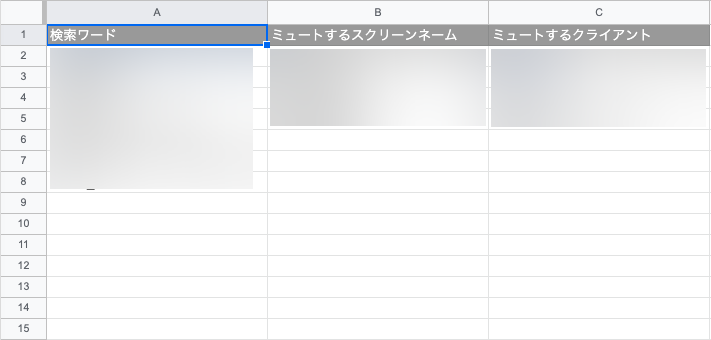
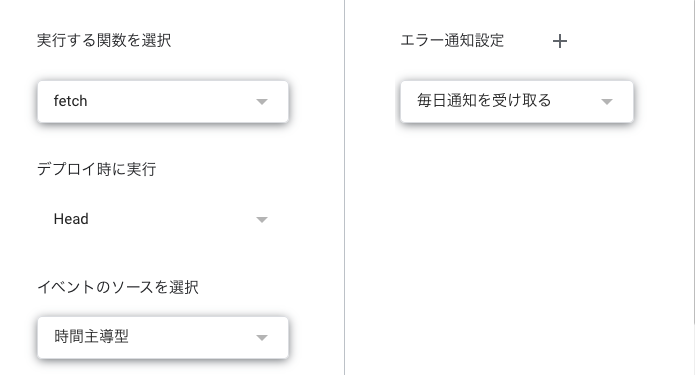

# gas-twitter-rss

スプレッドシートに追加した単語Twitterで定期検索してRSSで配信

## できること

- Twitterの定期検索
- 特定ユーザーのツイートを除外
- 特定クライアントからのツイートを除外

## 使い方メモ

<details>
<summary>開く</summary>

### 1. スプレッドシートとスクリプトを作成

新規スプレッドシートを作成。  
`拡張機能 > AppsScript`でGASを有効化。

### 2. コードをclone

```sh
git clone x7ddf74479jn5/gas-twitter-rss
```

### 3. clasp.jsonの編集

ブラウザでスクリプトエディタを開き、スクリプトIDを確認する。  
`.clasp.example.json`を`.clasp.json`にリネームする。  
`.clasp.json`の中のスクリプトIDを書き換える。

### 4. ビルドとデプロイ

```shell
npm run build
npm run push
```

### 5. スクリプトのプロパティを設定

スクリプトエディタからスクリプトの設定を開く。  
次に、 `スクリプトプロパティの編集 > スクリプトプロパティの追加` を押下し、`twitterToken` という名前でTwitter API v2のベアラートークンを設定する。

### 6. スプレッドシートを編集する



### 7. トリガーを設定する



実行する関数を `fetch` にしておく。

### 8. 公開してRSSリーダに登録

`appsscript.json`で設定済み。  
うまくいかないときは下記の通り実行する。

`デプロイ > 新しいデプロイ > 種類の選択 > ウェブアプリ`

| 説明 | 任意の説明文 |
|---|---|
| ウェブアプリ |   |
| 次のユーザーとして実行 | 自分 |
| アクセスできるユーザー | Google アカウントを持つ全員 |

その後表示されるURLを任意のRSSリーダに追加して完了！

</details>
